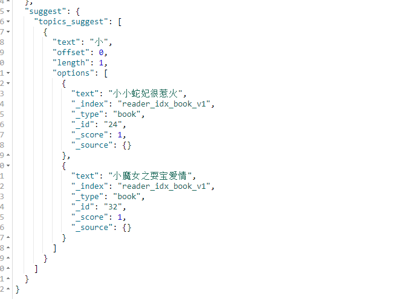
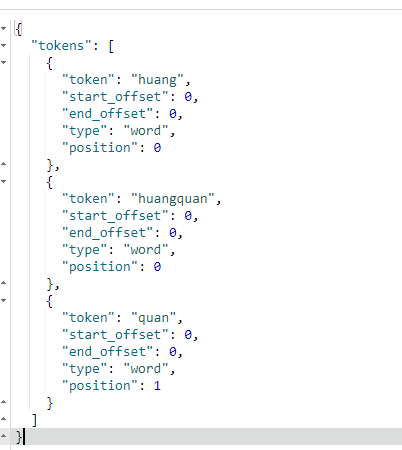

# ES中文搜索引擎

## 索引创建
	
	PUT /_template/template_reader
	{
	  "index_patterns": [
	    "reader_idx_*"
	  ],
	  "order": 2,
	  "settings": {
	    "analysis": {
	      "analyzer": {
	        "pinyin_analyzer": {
	          "tokenizer": "ik_max_word",
	          "filter": [
	            "pinyin_filter",
	            "word_delimiter"
	          ]
	        },
	        "pinyin_analyzer_smart": {
	          "tokenizer": "ik_smart",
	          "filter": [
	            "pinyin_filter",
	            "word_delimiter"
	          ]
	        }
	      },
	      "filter": {
	        "pinyin_filter": {
	          "type": "pinyin",
	          "keep_first_letter": false,
	          "keep_full_pinyin": false,
	          "keep_joined_full_pinyin": true
	        }
	      }
	    },
	    "number_of_shards": "5",
	    "number_of_replicas": "1"
	  },
	  "mappings": {
	    "_default_": {
	      "dynamic_templates": [
	        {
	          "title": {
	            "match_mapping_type": "string",
	            "match": "title",
	            "mapping": {
	              "type": "text",
	              "analyzer": "ik_max_word",
	              "search_analyzer": "ik_smart",
	              "fields": {
	                "keyword": {
	                  "ignore_above": 256,
	                  "type": "keyword"
	                },
	                "pinyin": {
	                  "type": "text",
	                  "analyzer": "pinyin_analyzer",
	                  "search_analyzer": "pinyin_analyzer_smart"
	                },
	                "suggest": {
	                  "type": "completion",
	                  "analyzer": "ik_max_word",
	                  "search_analyzer": "ik_smart"
	                }
	              }
	            }
	          }
	        },
	        {
	          "info": {
	            "match_mapping_type": "string",
	            "match": "info",
	            "mapping": {
	              "type": "text",
	              "analyzer": "ik_max_word",
	              "search_analyzer": "ik_smart",
	              "fields": {
	                "pinyin": {
	                  "type": "text",
	                  "analyzer": "pinyin_analyzer",
	                  "search_analyzer": "pinyin_analyzer_smart"
	                  
	                }
	              }
	            }
	          }
	        },
	        {
	          "strings": {
	            "match_mapping_type": "string",
	            "match": "*_text",
	            "mapping": {
	              "type": "text",
	              "analyzer": "ik_max_word",
	              "search_analyzer": "ik_smart",
	              "fields": {
	                "keyword": {
	                  "ignore_above": 256,
	                  "type": "keyword"
	                },
	                "pinyin": {
	                  "type": "text",
	                  "analyzer": "pinyin_analyzer",
	                  "search_analyzer": "pinyin_analyzer_smart"
	                }
	              }
	            }
	          }
	        }
	      ]
	    }
	  }
	}

## 搜索

	POST /reader_idx_book/_search
	{
	  "size": 20,
	  "query": {
	    "function_score": {
	      "query": {
	        "bool": {
	          "must": [
	            {
	              "multi_match": {
	                "query": "小",
	                "type": "best_fields",
	                "fields": [
	                  "title^1000000000",
	                  "author_name_text^100000000",
	                  "category_slave.keyword^10000000",
	                  "category3.keyword^1000000",
	                  "category_master.keyword^100000",
	                  "info^10000",
	                  "title.pinyin^1000",
	                  "author_name_text.pinyin^100",
	                  "info.pinyin^10",
	                  "tag"
	                ]
	              }
	            }
	          ],
	          "filter": [
	            {
	              "term": {
	                "shelf_status": "1"
	              }
	            },
	            {
	              "term": {
	                "category_master": "女"
	              }
	            }
	          ]
	        }
	      },
	      "script_score": {
	        "script": {
	          "lang": "expression",
	          "source": "_score * doc['allwords']/1000000"
	        }
	      }
	    }
	  },
	  "highlight": {
	    "fields": {
	      "*": {}
	    }
	  }
	}

## 直达区

	POST /_all/_search
	{
	  "size": 1,
	  "query": {
	    "bool": {
	      "filter": {
	        "term": {
	          "status": "1"
	        }
	      },"must": [
	        {"term": {
	          "title.keyword": {
	            "value": "万法唯心"
	          }
	        }}
	      ]
	    }
	  }
	}

## 联想词

	POST /reader_idx_*/_search
	{
	  "suggest": {
	    "song-suggest": {
	      "prefix": "太上",
	      "completion": {
	        "field": "title.suggest"
	      }
	    }
	  }
	}

## 问题分析

### 1.使用拼音无法获得高亮位置

描述：


参考：[Day 2 - ES 6.x拼音分词高亮爬坑记](https://elasticsearch.cn/article/6166)

解决：因为pinyin bug导致无法获取高亮位置，仅使用pinyin作为filter可以解决。文章推荐的使用ngram作为分词器索引和查询的性能极差，这里改成了使用ik作为分词器。
	
	    "analysis": {
	      "analyzer": {
	        "pinyin_analyzer": {
	          "tokenizer": "ik_max_word",
	          "filter": [
	            "pinyin_filter",
	            "word_delimiter"
	          ]
	        }
	      },
	      "filter": {
	        "pinyin_filter": {
	          "type": "pinyin",
	          "keep_first_letter": false,
	          "keep_separate_first_letter": false,
	          "keep_full_pinyin": true,
	          "keep_joined_full_pinyin": true,
	          "keep_original": false,
	          "limit_first_letter_length": 16,
	          "lowercase": true,
	          "remove_duplicated_term": true
	        }
	      }
	    },

# 2.使用complete suggestion查询reader_idx_*时无法得到所有结果

描述:

	GET reader_idx_*/_search
	{
	  "_source": "false",
	  "suggest": {
	    "topics_suggest": {
	      "completion": {
	        "field": "title.suggest"
	      },
	      "prefix": "小"
	    }
	  }
	}


	GET reader_idx_book/_search
	{
	  "_source": "false",
	  "suggest": {
	    "topics_suggest": {
	      "completion": {
	        "field": "title.suggest"
	      },
	      "prefix": "小"
	    }
	  }
	}



解决：suggest数量限制，可控，加上size字段即可

	GET reader_idx_*/_search
	{
	  "_source": "false",
	  "suggest": {
	    "topics_suggest": {
	      "completion": {
	        "field": "title.suggest",
	        "size": 10
	      },
	      "prefix": "小"
	    }
	  }
	}

# 3. 使用搜索查询联想词时查出不相关数据
问题描述：
```
GET /reader_idx_*/_search
{
  "query": {
    "function_score": {
      "functions": [
        {
          "script_score": {
            "script": {
              "source": "_score * 1"
            }
          }
        }
      ],
      "query": {
        "bool": {
          "filter": {
            "term": {
              "status": "1"
            }
          },
          "must": {
            "multi_match": {
              "fields": [
                "title^10",
                "title.pinyin^1"
              ],
              "query": "黄泉",
              "tie_breaker": 0,
              "type": "best_fields"
            }
          }
        }
      }
    }
  }
}
```


分析：输入会分别转换成中文分词和拼音分词在title及title.pinyin字段上进行分词，分词情况如下

```
GET /read_idx_category/_analyze
{
  "field": "title",
  "text": "黄泉"
}
```


```
GET /read_idx_category/_analyze
{
  "field": "title.pinyin",
  "text": "黄泉"
}
```



可以看到拼音分词的粒度更细，而且因为是拼音匹配，会匹配到同音字，显得搜索结果不大相关。拼音分词比中文分词更细的原因是中文分词建立索引使用了ik_max，搜索时分词使用ik_smart，拼音没有指定搜索分词器，直接使用了建立索引的更细的分词器。这里应该改成拼音搜索时采用更粗粒度的分词器。

## 压测

ES机器配置：16核64G内存200G硬盘，2节点
索引shard：2
压测时间：1min
超时时间：100ms
压测机：V8-16-200

1. term in text
	
	|客户端数|QPS|成功率|average time cost|min cost|max time cost|ES CPU|
	|---|
	|200|4134|100%|48 ms|0 ms|248 ms|27.6%|
	|300|4014|100%|74 ms|0 ms|345 ms|27.2%|
	|350|3964|100%|88 ms|0 ms|449 ms|26.9%|
	|400|3975|100%|100 ms|0 ms|521 ms|27.4%|

2. term in text with pretty

	|客户端数|QPS|成功率|average time cost|min cost|max time cost|ES CPU|
	|---|
	|200|3393|100%|59 ms|0 ms|909 ms|27.6%|
	|300|3421|100%|87 ms|0 ms|827 ms|27.2%|
	|350|3405|100%|103 ms|0 ms|937 ms|26.9%|
	|400|3419|100%|117 ms|0 ms|1017 ms|27.4%|

3. term in keyword

	|客户端数|QPS|成功率|average time cost|min cost|max time cost|ES CPU|
	|---|
	|50|5057|100%|9 ms|0 ms|111 ms|24.1%|
	|100|5834|100%|17 ms|0 ms|142 ms|24.5%|
	|200|5478|100%|36 ms|0 ms|594 ms|23.2%|
	|300|5305|100%|56 ms|0 ms|348 ms|22.9%|
	|400|5263|100%|76 ms|0 ms|420 ms|37.6%|
	|500|5245|98.7%|95 ms|0 ms|548 ms|34.8%|
	|500|5245|98.7%|95 ms|0 ms|548 ms|%|

4. multi match in text

	|客户端数|QPS|成功率|average time cost|min cost|max time cost|ES CPU|
	|---|
	|50|4667|100%|10 ms|0 ms|171 ms|57.8%|
	|100|4991|100%|20 ms|0 ms|162 ms|58.8%|
	|200|4960|100%|40 ms|0 ms|247 ms|44.9%|
	|300|5262|100%|57 ms|0 ms|328 ms|62.4%|
	|400|5408|99.8%|73 ms|0 ms|363 ms|52.5%|
	|500|5449|98.7%|91 ms|0 ms|1300 ms|57.8%|
	|600|5233|98.7%|114 ms|0 ms|1694 ms|%|

5. 100并发

	|查询条件|QPS|成功率|average time cost|min cost|max time cost|
	|---|
	|短连接 term|4021|100%|24 ms|0 ms|332 ms|
	|短连接 term with pretty|3864|100%|25 ms|0 ms|352 ms|
	|短连接 multi match *1|2726|100%|36 ms|0 ms|430 ms|
	|短连接 multi match *10|2438|100%|41 ms|0 ms|369 ms|
	|长连接 multi match *1|2277|100%|44 ms|0 ms|469 ms|
	|长连接 multi match *10|1804|100%|55 ms|0 ms|313 ms|
	|长连接 multi match *10 + script|1379|100%|72 ms|0 ms|653 ms|
	|长连接 multi match *10 + script + highlight*|574|100%|174 ms|0 ms|990 ms|
	|长连接 multi match *10 + script + highlight[]|535|100%|187 ms|0 ms|1287 ms|
	|长连接 multi match *10 + script + highlight[] limit20|225|100%|447 ms|0 ms|1554 ms|
	|搜索API|288|100%|348 ms|0 ms|1035 ms|

	分析：
	
	1. 使用pretty比不使用的性能下降3.9%
	1. multi match 性能比 term性能下降32.2%
	1. 使用长连接性能下降16.5%
	1. 10个字段搜索比1个字段搜索性能下降20.8%
	1. 使用脚本打分性能下降23.6%
	1. 使用高亮性能下降58.4%
	1. limit20比limit10性能下降57.9%