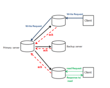
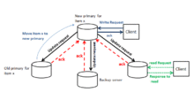

# 一致性模型(Consistency model)

[原文链接](https://en.wikipedia.org/wiki/Consistency_model)

在计算机科学中，一致性模型(consistency models)用于分布式系统，如分布式共享内存系统或分布式数据存储(例如文件系统，数据库，乐观复制系统或Web缓存)。如果内存操作遵循特定规则，则称该系统支持给定模型。数据一致性模型指定程序员和系统之间的契约，其中系统保证如果程序员遵守规则，内存将是一致的并且读取，写入或更新存储器的结果是可预测的。这与在高速缓存或无高速缓存的系统中发生的一致性(coherence)不同，是与所有处理器相关的数据的一致性。一致性(Coherence)处理的是维护一个全局顺序，其中所有处理器都可以看到对单个位置或单个变量的写入。一致性(Consistency )处理的是与所有处理器相关的多个位置的操作顺序。

高级语言，如c++和Java，通过将内存操作转换为保留内存语义的低级操作，在一定程度上维护了契约。为了遵守约定，编译器可能会重新排序一些内存指令，而pthread_mutex_lock()等库调用封装了所需的同步。

通常，无法通过模型检查(model check)来验证顺序一致性，即使对于有限状态高速缓存一致性(coherence)协议也是如此。

一致性模型(consistency models)规定了表面上的顺序和更新操作的可见性，是一个折衷的统一体。

## 示例

假设出现以下情况：

- 行X在节点M和N上冗余存储
- 客户端A将行X写入节点M.
- 在一段时间t之后，客户端B从节点N读取行X.

一致性模型必须确定客户端B是否看到来自客户端A的写入。

## 类型

有两种方法可以定义和分类一致性模型; 问题(issue)和视图(view)。

__问题(issue)__

问题方法描述了定义进程如何发出操作的限制。

__视图(view)__

视图方法，定义进程可见的操作顺序。

例如，一致性模型可以定义在完成所有先前发布的操作之前不允许进程发出操作。不同的一致性模型执行不同的条件。如果一个一致性模型需要该模型的所有条件，则可以认为它比另一个更强。换句话说，具有较少约束的模型被认为是较弱的一致性模型。

这些模型定义了硬件需要如何布局，以及更高级别，程序员必须如何编码。所选模型还会影响编译器重新排序指令的方式。通常，如果指令之间的控件依赖关系和对相同位置的写入是有序的，那么编译器可以根据需要重新排序。但是，对于下面描述的模型，有些可能允许在加载之前进行重新排序，而有些则可能没有。

### 严格一致(Strict consistency)

严格一致性是最强的一致性模型。在这种模式下，所有处理器都需要立即看到任何处理器对变量的写入。

严格的模型图和非严格的模型图描述了时间约束 - 瞬时。可以更好地理解，好像存在全局时钟，其中每个写入应该在该时钟周期结束时反映在所有处理器高速缓存中。下一个操作必须仅在下一个时钟周期内发生。

|序列|严格的模型||非严格的模型||
|---|---|---|---|---|
||P1|P2|P1|P2|
|1|W(x)1||W(x)1|	
|2||R(x)1||R(x)0|
|3||||R(x)1|

这是最严格的模型。在此模型中，程序员的预期结果将每次都被接收。这是确定性的。

### 顺序一致性(Sequential consistency)

顺序一致性模型，是由兰波特(Lamport(1979))提出的。它是一种比严格一致性模型(Strict consistency)更弱的内存模型。不必立即看到对变量的写入，但是，所有处理器必须以相同的顺序看到不同处理器对变量的写入。正如兰波特(Lamport(1979))所定义的那样，如果“任何执行的结果与所有处理器的操作以某种顺序执行的结果相同，并且每个处理器的操作按其程序指定的顺序出现在这个序列中”，则满足顺序一致性(Sequential consistency)。

应该维护每个处理器中的程序顺序和处理器之间操作序列的顺序。为了保持处理器之间执行的顺序，相对于每个其他处理器所有的操作必须看起来是即时的或原子的。这些操作只需要"看起来"完成，因为物理上不可能立即发送信息。例如，一旦总线上发布了信息，就可以保证所有处理器都能在同一时刻看到这些信息。因此，将信息传递给总线对所有处理器而言就可以认为执行完成了，并且看起来已经执行了。具有非瞬时互连网络的无缓存体系结构或缓存体系结构可能包含处理器和存储器之间的慢速路径。这些慢速路径可能导致顺序不一致，因为某些存储器比其他存储器更快地接收广播数据。

顺序一致性会产生不确定的结果。这是因为处理器之间的顺序操作序列在程序的不同运行期间可能是不同的。所有内存操作都需要按程序顺序进行。

线性化(Linearizability)(也称为原子一致性(atomic consistency))可以定义为带有实时性约束的顺序一致性。

### 因果一致性(Causal consistency)

因果一致性(Causal consistency)是一种弱化的顺序一致性(Sequential consistency)模型，它将事件分为了存在因果关系和不存在因果关系两类。它定义了只有与因果相关的写操作才需要被所有进程以相同的顺序看到。

该模型放松了处理器并发写和跟这些写入不存在因果相关的写操作的顺序一致性。如果对一个变量的一次写入依赖于之前对任何变量的写入(如果执行第二次写入的处理器刚刚读取了第一次写入)，那么两次写入可能会有因果关系。这两个写操作可以由同一个处理器完成，也可以由不同的处理器完成。

与顺序一致性一样，读取不需要即时反映更改，但是，它们需要按顺序反映变量的所有更改。

|序列|P1|P2|
|---|---|---|
|1|W1(x)3||	
|2||W2(x)5|
|3||R1(x)3|

W1与W2没有因果关系。R1将顺序不一致，但是因果一致。

|序列|P1|P2|P3|P4|
|---|---|---|---|---|
|1|	W(x)1|R(x)1|R(x)1|R(x)1|
|2|||W(X)2||
|3|W(X)3||R(X)3|R(X)2|
|4|||R(X)2|R(X)3|

由于P2在W(x)2之前先读取了x，W(x)1和W(x)2是因果相关的。

### 处理器一致性(Processor consistency)

为了保持数据的一致性，实现每个处理器都有自己的内存的可伸缩处理器系统，衍生出了处理器一致性模型。所有处理器都需要保持一致，它们看到一个处理器写操作的顺序以及看到不同处理器写到相同位置的方式(保持连贯性(coherence ))。但是，当不同处理器写入不同位置时，它们不需要保持一致。

每一个写操作都可以被分成几个对所有内存的子写操作。从一个这样的内存中读取可以在对该内存的写入完成之前发生。因此，读取的数据可能会过期。因此，当旧的存储需要过期时，PC下的处理器可以执行较新的加载。在这个模型中，读前写、读后读和写前写的顺序仍然保持不变。

处理器一致性模型(processor consistency model)类似于PRAM一致性(PRAM consistency model)模型，它有一个更强的条件，即所有对相同内存位置的写入必须以相同的顺序被所有其他进程看到。处理器一致性弱于顺序一致性，但强于PRAM一致性模型。

斯坦福DASH多处理器系统实现了处理器一致性的变种，这是古德曼(Goodman) )定义所无法比拟的(既不弱也不强)。所有处理器需要按照它们看到一个处理器写入的顺序以及它们看到不同处理器写入同一位置的方式保持一致。但是，当不同处理器写入不同位置时，它们不需要保持一致。

### 流水线RAM一致性(Pipelined RAM consistency)或FIFO一致性(FIFO consistency)

流水线RAM一致性(PRAM一致性)是Lipton和Sandberg在1988年首次描述的一致性模型之一。由于其非正式的定义，实际上至少有两种稍微不同的实现，一种是由Ahamad等人实现的，另一种是由Mosberger实现的。

在PRAM一致性中，所有进程看到单个进程的操作顺序跟该进程实际发出操作的顺序是一样的，而不同进程看到不同进程发出的操作的顺序可以不同。PRAM一致性弱于处理器一致性。PRAM放松了保持所有处理器之间的位置一致性的需要。在这里，对任何变量的读操作都可以在处理器中的写操作之前执行。在这个模型中，读前写、读后读和写前写的顺序仍然保持不变。

|序列|P 1|P 2|P 3|P 4|
|---|---|---|---|---|
|1|	W(x)1||||			
|2|		|R(x)1|||		
|3|		|W(X)2|||		
|4|			||R(x)1|R(X)2|
|5|			||R(X)2|R(x)1|

### 缓存一致性(Cache consistency)

高速缓存一致性要求对同一存储器位置的所有写操作都按某种顺序执行。缓存一致性比顺序一致性弱，并且与PRAM一致性无法比较。

### 慢一致性(Slow consistency)

在慢一致性(Slow consistency)中，如果进程读取先前写入内存位置的值，则它随后不能从该位置读取任何更早期的值。进程执行的写操作对该进程是立即可见的。与PRAM和缓存一致性相比，慢一致性是一个较弱的模型。

示例： 慢内存图描述了一个慢一致性的例子。第一个进程将1写入内存位置X，然后将1写入内存位置Y。第二个进程从Y读取1，然后从X读取0，即使X是在Y之前写入的。

Hutto, Phillip W., 和 Mustaque Ahamad (1990)说明，通过适当的编程，缓慢的内存(一致性)可以有表现力的和高效的。他们提到慢一致性有两个宝贵的特性;局部性和支持从原子内存中减少。他们提出了两种算法来表示慢速存储器的表达能力。

以下模型需要程序间进行特殊的同步。

#### 弱排序(Weak ordering)

程序顺序和原子性仅在一组操作上维护，而不是在所有读和写上维护。这是基于这样一种理解:某些内存操作(例如在临界区(critical section)中执行的操作)不需要被所有处理器看到，直到临界区(critical section)中的所有操作都完成为止。它还利用了这样一个事实，即编写在多处理器系统上执行的程序包含所需的同步，以确保不会发生数据竞争，并始终生成SC结果。因此，在弱序中，同步操作之外的操作可以被分类为数据操作。

|P 1|P 2|
|---|---|
|X = 1; fence xready = 1;|fence while(!xready) &#123;&#125;&#59;  fence y = 2;|

同步操作向处理器发出信号，以确保它已经完成并看到所有处理器之前完成的所有操作。为了保持弱排序(Weak ordering)，必须在同步操作之前全局执行同步操作之前的写操作。同步操作之后的操作也应仅在同步操作完成后执行。因此，对同步变量的访问是顺序一致的，并且只有在先前的同步操作完成之后才应执行任何读或写。在这个模型中连贯性(Coherence )并没有被放松。满足这些要求后，可以重新排序所有其他“数据”操作。

程序高度依赖于显式同步。对于弱顺序模型，程序员必须使用原子锁定指令，如test-and-set、fetch-and-op、存储条件(store conditional)、加载链接(load linked)或必须标记同步变量或使用栅栏(fences)。

### 释放一致性(release consistency)

在释放一致性(release consistency)模型通过区分入口同步操作和出口同步操作来放松弱一致性( weak consistency)模型。在弱排序(weak ordering)下，当要看到同步操作时，在完成同步操作并且处理器继续进行之前，所有处理器中的所有操作都需要是可见的。但是，在释放一致性(release consistency)模型下，在进入关键部分(称为“获取”)期间，需要完成与本地内存变量相关的所有操作。在退出期间，称为“释放”，本地处理器所做的所有更改都应传播到所有其他处理器。一致性(Coherence )仍然保持。

获取操作是为访问临界区而执行的加载/读取。释放操作是执行存储/写入以允许其他处理器使用共享变量。

在同步变量中，可以保持顺序一致性(sequential consistency)或处理器一致性(processor consistency can be maintained)。使用SC，应按顺序处理所有竞争同步变量。但是，对于PC，一对竞争变量只需遵循此顺序。较年轻的获取可以在较老的释放之前发生。

### 入口一致性(Entry consistency)

这是释放一致性(release consistency)的变体。它还需要使用获取和释放指令来显式地声明临界区(critical section)的入口或出口。然而，在入口一致性(entry consistency)下，每个共享变量都被分配一个特定于它的同步变量。这样，只有当获取变量x时，所有与x相关的操作才需要针对该处理器完成。这允许对不同共享变量的不同临界区(critical section)进行并发操作。不允许在同一共享变量上发生关键操作(critical operations)。当可以同时处理不同的矩阵元素时，这种一致性模型将是有用的。

### 一般一致性(General consistency)

在一般一致性(General consistency)中，在完成所有进程的写入之后，内存位置的所有副本最终都是相同的。

### 局部一致性(Local consistency)

在局部一致性(local consistency)中，每个进程按照其程序定义的顺序执行自己的操作。其他进程的写操作执行顺序没有限制。局部一致性是共享内存系统中最弱的一致性模型。

### 其他一致性模型

其他一些一致性模型如下：

- 因果+一致性(Causal+ consistency)
- 增量一致性(Delta consistency)
- 最终的一致性(Eventual consistency)
- Fork一致性(Fork consistency)
- 单副本可串行化(One-copy serializability)
- 串行化(Serializability)
- 矢量场一致性(Vector-field consistency)
- 弱一致性(Weak consistency)
- 强一致性强(Strong consistency)

其他几个一致性模型已经被设想用来表达操作的顺序或可见性方面的限制，或者处理特定的故障假设。

## 宽松的内存一致性模型

通过在序列一致性中放松一个或多个需求，可以定义一些不同的一致性模型，称为宽松一致性(relaxed consistency)模型。这些一致性模型不提供硬件级别的内存一致性。实际上，程序员负责通过应用同步技术来实现内存一致性。以上模型基于四个标准进行分类，并进一步详述。

定义放松一致性有四个比较：

__宽松(Relaxation)__

对松弛一致性进行分类的一种方法是定义哪些顺序一致性需求是放松的。我们可以通过放松程序顺序或编写Adve和Gharachorloo(1996)定义的原子性要求来获得不那么严格的模型。程序顺序保证每个进程发出由其程序排序的内存请求，写原子性定义了内存请求是基于单个FIFO队列的顺序服务的。在放松程序顺序时，可以放松任何或所有操作对的顺序，即写后写、读后写或读/写后读。在宽松的写原子性模型中，进程可以在任何其他处理器之前查看自己的写。

__同步与非同步(Synchronizing vs. non-synchronizing)__

同步模型可以通过将内存访问划分为两组并为每组分配不同的一致性限制来定义，因为一组可能具有弱一致性模型，而另一组需要更严格的一致性模型。相反，非同步模型将相同的一致性模型分配给内存访问类型。

__问题vs.基于视图(Issue vs. view-based)__

通过定义进程发出内存操作的限制，Issue方法提供了顺序一致性模拟。然而，view方法描述了对流程的事件顺序的可见性限制。

__相关模型强度(Relative model strength)__

某些一致性模型比其他模型更具限制性。换句话说，严格的一致性模型将更多的约束作为一致性需求强制执行。模型的强度可以通过程序顺序或原子性松弛来定义，并且还可以比较模型的强度。如果某些模型应用相同的松弛或更多，则它们直接相关。另一方面，放松不同要求的模型并不直接相关。

顺序一致性有两个要求，即程序顺序和写入原子性。通过放宽这些要求可以获得不同的松弛一致性模型。这样做是为了在放松约束的同时提高性能，但程序员负责通过应用同步技术来实现内存一致性，并且必须对硬件有很好的理解。

潜在的放松：

- 写后读(Write to read)程序顺序
- 写后写(Write to write)程序顺序
- 读后读(Read to read)和读后写(read to write)程序顺序

### 宽松模型

以下模型是宽松一致性的一些模型：

#### 放松写后读(write to read)

在硬件级别提高性能的一种方法是放松紧跟着读操作的写操作的PO，这样可以有效地隐藏写操作的延迟。这种类型的放松所依赖的优化是，相对于处理器先前的写操作，它允许后续的读操作以放松的顺序进行。由于这种放松，一些像XXX这样的程序可能会因为这种放松而不能给出SC结果。然而，由于强制执行了剩余的程序顺序约束，像YYY这样的程序仍然需要给出一致的结果。

有三种模型被归为这一类。IBM 370模型是最严格的模型。在对另一个地址进行较早的写操作之前，可以完成一次读操作，但是禁止返回写操作的值，除非所有处理器都看到了写操作。SPARC V8的total store order model (TSO)模型在一定程度上放松了IBM 370模型，它允许read返回它自己的处理器相对于相同位置的其他写操作的写操作的值，也就是说，它在其他人看到它之前返回它自己的写操作的值。与前面的模型类似，除非所有处理器都看到写操作，否则不能返回写操作的值。处理器一致性模型(PC)是这三种模型中最宽松的，并且放松了这两种约束，这样读操作可以在更早的写操作之前完成，甚至在其他处理器可以看到它之前。

在示例A中，只有在IBM 370中才有可能得到结果，因为在处理器中的写(A)完成之前，不会发出read(A)。另一方面，这个结果在TSO和PC中是可能的，因为它们允许在单个处理器中先读取标志，然后再写入标志。

在例B中，这个结果只有在PC上才可能，因为它允许P2返回写的值，甚至在P3可以看到写之前。这在其他两个模型中是不可能的。

为了确保上述模型中的顺序一致性(sequential consistency)，使用安全网或栅栏手动执行约束。IBM370模型有一些专门的串行化指令(serialisation instructions)，这些指令被手动放置在操作之间。这些指令可以包括存储器指令或非存储器指令，例如分支。另一方面，TSO和PC模型不提供安全网，但程序员仍然可以使用读-修改-写操作使其看起来像在写和后续读之间仍保持程序顺序。在TSO的情况下，如果已经是R-modify-W的一部分的R或W被R-modify-W替换，则PO似乎会被维护，这要求R-modify-W中的W是一个返回R的值的“dummy”。类似地，对于PC，如果读被写替换，或者已经是R-modify-W的一部分，则PO似乎会被维护。

然而，编译器优化不能在单独执行这种放松之后完成。编译器优化需要对PO中的任意两个操作重新排序的充分灵活性，因此在这种情况下，对写操作相对于读操作重新排序的能力是不够有用的。

例A

|P 1|P 2|
|---|---|
|A = flag1 = flag2 = 0|<-|
|flag1 = 1|flag2 = 1|
|A = 1|A = 2|
|reg1 = A.|reg3 = A.|
|reg2 = flag2|reg4 = flag1|
|reg1 = 1; reg3 = 2，reg2 = reg4 = 0|

例B

|P 1|P 2|P 3|
|---|---|---|
|A = B = 0|<-|<-|
|A = 1|||		
||if(A == 1)||	
||B = 1|if(B == 1)|
|||reg1 = A.|
|B = 1，reg1 = 0|<-|<-|

#### 放松写后读(write to read)和写后写(write to write)

有些模型甚至通过放松对不同位置的写之间的顺序约束来进一步放松程序顺序。SPARC V8 partial store ordering model(PSO)是这种模型的唯一例子。管道和重叠写入来自同一处理器的不同位置的能力是PSO启用的关键硬件优化。PSO在原子性要求方面类似于TSO，因为它允许处理器读取其自身写入的值并防止其他处理器在写入对所有其他处理器可见之前读取另一个处理器的写入。PSO使用显式STBAR指令维护两次写入之间的程序顺序。在使用FIFO写缓冲区的实现中，STBAR被插入写缓冲区。计数器用于确定何时STBAR指令之前的所有写操作都已完成，这会触发对存储器系统的写操作以增加计数器。写确认会递减计数器，当计数器变为0时，表示所有先前的写操作都已完成。

在示例A和B中，PSO允许这两种非顺序一致的结果。PSO提供的安全网类似于TSO，它强制执行从写入到读取的程序顺序并强制执行写入原子性。

与之前的模型类似，PSO允许的松弛不够灵活，无法用于编译器优化，这需要更灵活的优化。

#### 放松读和读后写(read to write)程序顺序

在某些模型中，放松了对不同位置的所有操作。可以针对不同的读取或写入在不同的位置重新排序读取或写入。弱序可分为这一类，两种释放一致性(release consistency)模型(RCsc和RCpc)也可以归到这个模型。在此放松类别下还提出了三个商业体系结构:Digital Alpha、SPARC V9 relaxed memory order(RMO)和IBM PowerPC模型。除了Digital Alpha之外，所有这些模型都允许对相同位置的读取进行重新排序。这些模型违反了示例A和B中的顺序次序。这些模型中允许的另一种松弛是在以前的模型中没有的，即读取操作之后的内存操作可以与读取操作重叠并重新排序。除了RCpc和PowerPC之外，所有这些模型都允许read返回另一个处理器早期写的值。从程序员的角度来看，所有这些模型都必须保持写原子性的假象，即使它们允许处理器提前读取自己之前写的值。

根据所提供的安全网类型，这些模型可以分为两类。在这里，可以看到精心编写的程序的必要性。同步的本质有助于对弱序模型、RCsc模型和RCpc模型进行分类。Alpha、RMO和PowerPC模型提供了fence指令，因此可以在不同的内存操作之间强制执行程序顺序。

#### 弱序(Weak ordering)

一个模型的例子是弱序，它放松了上面的大部分约束(除了提前读取其他人的写)。它将内存操作分为两类：数据操作和同步操作。为了强制执行程序顺序，程序员需要在程序中找到至少一个同步操作。这种方法的假设是，在同步操作之间将数据区域的内存操作重新排序不会影响程序的结果。它们只是作为执行程序订单的安全网。其工作方式是计数器跟踪数据操作的数量，并且在该计数器变为零之前，不发出同步操作。此外，除非完成所有先前的同步，否则不再发出数据操作。两个同步变量之间的存储器操作可以重叠和重新排序，而不会影响程序的正确性。该模型确保始终保持写原子性，因此对于弱排序不需要额外的安全网。

#### 释放一致性(Release consistency)：RCsc和RCpc 

发布一致性有两种类型:顺序一致性的释放一致性(RCsc)和处理器一致性的释放一致性(RCpc)。后一种类型表示哪种类型的一致性适用于下面提到的特殊操作。

有一些特殊的(cf. ordinary)内存操作，它们本身由两类操作组成：sync或nsync操作。后者是不用于同步的操作;前者包括获取和释放操作。获取实际上是一种读取内存操作，用于获取对一组共享位置的访问。另一方面，Release是一个写操作，用于授予访问共享位置的权限。

对于顺序一致性(RCsc)，约束是：

- acquire → all,
- all → release,
- special → special.

对于处理器一致性(RCpc)，写入读取程序顺序是放宽的，具有约束：

- acquire → all,
- all → release,
- special → special (除了特殊的写之后是特殊的读之外).

注意:上面的符号A→B，表示如果在程序顺序中操作A在B之前，那么程序顺序是强制执行的。

#### Alpha，RMO和PowerPC 

这三个商业体系结构将明确的fence指令作为它们的安全网。Alpha模型提供两种类型的fence指令，memory barrier(MB)和write memory barrier 屏障(WMB)。MB操作可用于维护MB之前的任何内存操作的程序顺序，以及屏障之后的内存操作。类似地，WMB只在写之间维护程序顺序。SPARC V9 RMO模型提供了一个MEMBAR指令，可以定制该指令来根据将来的读写操作对以前的读写进行排序。不需要使用read-modify-write来实现这个顺序，因为可以使用MEMBAR指令对后续的读执行写操作。PowerPC模型使用一个称为SYNC指令的隔离指令。它类似于MB指令，但有一个小的例外，即即使在对同一位置的两次读取之间进行同步，读取也可能会超出程序顺序。这个模型在原子性方面也不同于Alpha和RMO。它允许在读取完成之前看到写操作。为了制造写原子性的假象，可能需要结合读修改写操作。

## 事务性内存模型

事务性内存模型是高速缓存一致性(cache coherency)和内存一致性(memory consistency)模型的组合，作为软件或硬件支持的共享内存系统的通信模型; 事务内存模型同时提供内存一致性(memory consistency)和缓存一致性(cache coherency)。事务是由将数据从一个一致状态转换为另一个状态的进程执行的一系列操作。事务在没有冲突或中止时提交。在提交中，当事务完成时，所有其他进程都可以看到所有更改，而中止会丢弃所有更改。与宽松一致性模型相比，事务模型更易于使用，并且可以提供比顺序一致性模型更高的性能。

## 一致性和复制

Tanenbaum等人，2007年定义了复制的两个主要原因;可靠性(reliability )和性能(performance)。在复制文件系统中，当使用的副本失败时，可以切换到另一个副本实现可靠性。复制还通过在不同副本上提供多个数据的拷贝来保护数据不受损坏。它还通过细分工作来提高性能。虽然复制可以提高性能和可靠性，但它可能会导致多个数据副本之间出现一致性问题。如果读取操作从所有副本返回相同的值，并且作为单个原子操作(事务)的写入操作在任何其他操作发生之前更新所有副本，则多个副本是一致的。Tanenbaum，Andrew和Maarten Van Steen，2007 将这种类型的一致性称为同步复制提供的紧密一致性( tight consistency)。但是，应用全局同步以保持所有副本的一致性是昂贵的。降低全局同步成本和提高性能的一种方法是削弱一致性限制。

### 以数据为中心的一致性模型(Data-centric consistency models)

Tanenbaum等人，2007年将一致性模型( consistency model)定义为软件(进程)和内存实现(数据存储)之间的契约。这个模型保证如果软件遵循一定的规则，内存就能正常工作。由于在没有全局时钟的系统中，很难在写操作之间定义最后一个操作，所以可以对读操作返回的值应用一些限制。

#### 一致的操作顺序(Consistent ordering of operations)

某些一致性模型(如顺序和因果一致性模型)处理共享复制数据的操作顺序，以提供一致性。在此模型中，所有副本必须就更新的一致全局排序达成一致。

##### 顺序一致性(Sequential consistency)

以数据为中心的一致性( data-centric consistency)模型的目标是在数据存储上提供一致的视图，其中进程可以执行并发更新。一个重要的以数据为中心的一致性模型是Lamport(1979)定义的顺序一致性。 Tanenbaum等人，2007 定义了以下条件下的顺序一致性：

任何执行的结果都是相同的，就好像数据存储上的所有进程的(读和写)操作都是按某种顺序执行的，并且每个进程的操作都按其程序指定的顺序出现在这个序列中。

Adve和Gharachorloo，1996 定义了实现顺序一致性的两个要求; 程序顺序和写原子性。

- 程序顺序(Program orde)：程序顺序保证每个进程发出由其程序排序的内存请求。
- 写入原子性(Write atomicity)：写入原子性定义了基于单个FIFO队列的顺序来服务内存请求。

在顺序一致性(sequential consistency)中，没有时间或最近的写操作的概念。对于所有进程，存在一些相同的操作交错。进程可以看到所有进程的写操作，但它只能看到自己的读操作。

通过考虑每个操作的开始时间和结束时间,线性化(Linearizability)(原子存储器)可以被定义成是一种具有实时约束的顺序一致性(sequential consistency)。如果每个操作通过在其开始时间和结束时间之间放置一个点以线性化顺序进行并且保证顺序一致性，则执行是可线性化的。

##### 因果一致性(Causal consistency)

由Hutto和Ahamad, 1990定义的因果一致性是一个弱于顺序一致性的一致性模型，通过区分因果相关操作和不相关操作。例如，如果事件b从较早的事件a生效，则因果一致性保证所有流程都在事件a之后看到事件b。

Tanenbaum等人，2007 定义了在以下条件下数据存储被认为是因果一致的：

所有进程必须以相同顺序看到所有可能因果关系的写入。在不同的机器上，并发写可能以不同的顺序出现。[19]

##### 分组操作(Grouping operations)

在分组操作中，对同步变量的访问是顺序一致的。允许进程访问所有先前写入已完成的同步变量。换句话说，在完全执行对同步变量的所有操作之前，不允许访问同步变量。

#### 连续一致(Continuous consistency)

连续一致性稍后在一致性协议部分中定义。

### 以客户段为中心的一致性模型(Client-centric consistency models)

在分布式系统中，维护顺序一致性(sequential consistency)以控制并发操作至关重要。在一些没有同步更新的特殊数据存储中，以客户端为中心的一致性模型可以以一种成本更低的方式处理不一致性。以下模型是一些以客户端为中心的一致性模型：

#### 最终的一致性(Eventual consistency)

最终一致性(eventual consistency)是系统中缺乏同步更新的弱一致性模型。它定义了如果很长时间没有更新，那么所有的副本最终都会变得一致。

大多数共享的分散式数据库都有一个最终的一致性模型，BASE：基本可用(basically available); 软状态(soft state); 最终一致(eventually consistent)，或者ACID和BASE的组合有时称为SALT：顺序(sequential); 通过协议的(agreed); 记账的(ledgered); 防篡改(tamper-resistant)，也是对称的(symmetric); 无管理的(admin-free); 记账的(ledgered); 和时间一致(time-consensual)的。

#### 单调读一致性(Monotonic read consistency)

Tanenbaum等人，2007 将单调读取一致性定义如下：

“如果一个进程读取数据项x的值，那么该进程对x的任何后续读取操作都将始终返回相同的值或更新的值。”

单调读取一致性保证在进程在时间t读取数据项x的值之后，它将永远不会看到该数据项的旧值。

#### 单调写一致性(Monotonic write consistency)

单调写一致性条件由Tanenbaum等人，2007 定义如下：

“进程在数据项X上的写操作在同一进程对X上的任何后续写操作之前完成。” 

#### 读你所写一致性(Read-your-writes consistency)

由进程写入数据项X的值将始终可用于由数据项X上的相同进程执行的连续读取操作。

#### 写入跟随读取一致性(Writes-follows-reads consistency)

在写入跟随读取一致性(Writes-follows-reads consistency)中，在执行先前的读取操作之后传播更新。Tanenbaum等人，2007 定义了以下的写入跟随读取一致性(Writes-follows-reads consistency)的条件：

“一个进程在之前对数据项x执行读操作之后对x执行写操作，保证在被读的x的相同或更近的值上执行” [19]

### 一致性协议(Consistency protocols)

一致性模型的实现由一致性协议定义。Tanenbaum等人，2007 说明了以数据为中心的模型的一些一致性协议。

#### 连续一致性(Continuous consistency)

Yu和Vahdat(2000)引入了连续一致性(Continuous consistency)。在这个模型中，应用程序的一致性语义通过在应用程序中使用conits说明。由于一致性要求可能因应用语义而异，Yu和Vahdat(2000)认为预定义的统一一致性模型可能不是一种合适的方法。应用程序应指定满足应用程序语义的一致性要求。在此模型中，应用程序将每个一致性要求指定为conits(一致性单位的缩写)。conit可以是物理或逻辑一致性，用于衡量一致性。Tanenbaum等人，2007 通过举例说明了一个conit的概念。

应用程序可以容忍三种不一致。

__数值偏差(Deviation in numerical values)__

数值偏差限制了conit值与上次更新的相对值之间的差异。可以为写入分配权重，该权重定义了特定应用程序中写入的重要性。可以将conit的看不见写入的总权重定义为应用程序中的数值偏差(numerical deviation)。有两种不同类型的数值偏差; 绝对和相对数值偏差。

__顺序偏差(Deviation in ordering)__

顺序偏差是指复制中的本地写顺序与最终图像中的相对顺序之间的差异。

__副本之间的过时偏差(Deviation in staleness between replicas)__

过时偏差(Staleness deviation)通过限制当前时间与本地未见的conit上最早写入时间之间的差异来定义最早写入的有效性。每个服务器都有一个不确定写入的本地队列，需要确定一个实际的顺序并应用于conit。不确定写入队列的最大长度是顺序偏差的界限。当写的数量超过限制时，服务器将不接受新提交的写，而是根据应该执行写的顺序与其他服务器通信，尝试提交不确定的写。

如果所有三个偏差界限都设置为零，则连续一致性模型是强一致性。

### Primary-based协议

Primary-based protocols可以被认为是一种更容易实现的一致性协议。例如，当考虑操作的一致性顺序时，顺序排序(sequential ordering)是一种流行的一致性模型。可以将顺序排序确定为primary-based protocol。在这些协议中，数据存储中的每个数据项都有一个关联的主数据库，用于协调对该数据项的写操作。

#### 远程写协议(Remote-write protocols)

在支持复制的最简单的Primary-based(也称为主备协议( primary-backup))中，写操作被转发到单个服务器，读操作可以在本地执行。

示例： Tanenbaum等，2007 [19]给出了主备份协议的示例。主备份协议图显示了此协议的示例。当客户端请求写入时，写入请求将转发到主服务器。主服务器向备份发送请求以执行更新。然后，服务器从所有备份接收更新确认，并向客户端发送写入完成确认。任何客户端都可以在本地读取上次可用的更新 此协议的权衡是发送更新请求的客户端可能需要等待很长时间才能获得确认才能继续。可以通过在本地执行更新来解决此问题，然后请求其他备份执行其更新。非阻塞主备份协议不保证所有备份服务器上的更新一致性。然而，它提高了性能。在主备份协议中，所有进程都将看到相同的写操作顺序，因为此协议根据全局唯一时间对所有传入写入进行排序。阻塞协议保证进程查看上次写操作的结果。

#### 本地写协议(Local-write protocols)

在基于主的本地写协议中，主副本在执行更新的进程之间移动。要更新数据项，进程首先将其移动到其位置。结果，在该方法中，可以在本地执行连续的写操作，同时每个进程可以读取它们的数据项的本地副本。主数据库完成更新后，更新将转发到其他副本，并且所有副本都在本地执行更新。这种非阻塞方法可以带来改进。本地写协议的图表描述了基于主协议的本地写入方法。进程请求数据项x中的写操作。当前服务器被视为数据项x的新主要服务器。执行写操作，当请求完成时，主服务器向其他备份服务器发送更新请求。

### 复制写协议(Local-write protocols)

在复制写协议[19]中，与基于主协议的不同，所有更新都是对所有副本执行的。

#### 主动复制(Active replication)

在主动复制中，存在与每个副本相关联的进程以执行写操作。换句话说，更新以操作的形式发送到每个副本以便执行。所有更新都需要在所有副本中以相同的顺序执行。结果，需要完全有序的多播机制。在大型分布式系统中实现这种多播机制存在可扩展性问题。还有另一种方法，其中每个操作被发送到中央协调器(定序器)。协调器首先为每个操作分配序列号，然后将操作转发给所有副本。第二种方法也不能解决可扩展性问题。

#### 基于法定人数的协议(Quorum-based protocols)

投票可以是复制写协议中的另一种方法。在此方法中，客户端请求并从多个服务器接收权限，以便读取和写入复制的数据。例如，假设在分布式文件系统中，文件在N个服务器上复制。要更新文件，客户端必须至少向N / 2 + 1发送请求才能同意执行更新。在协议之后，对文件应用更改，并为更新的文件分配新的版本号。类似地，为了读取复制文件，客户端向N / 2 + 1服务器发送请求，以便从这些服务器接收关联的版本号。如果所有收到的版本号都是最新版本，则读取操作完成。

#### 缓存一致性协议(Cache-coherence protocols)

在复制文件系统中，缓存一致性协议提供缓存一致性，而缓存通常由客户端控制。在许多方法中，高速缓存一致性由底层硬件提供。基于中间件的分布式系统中的一些其他方法应用基于软件的解决方案来提供缓存一致性。

缓存一致性模型的一致性检测策略可能不同，这些策略定义何时出现不一致。检测不一致性有两种方法; 静态和动态解决方案。在静态解决方案中，编译器确定哪些变量可能导致缓存不一致。因此，编译器强制执行指令以避免不一致问题。在动态解决方案中，服务器在运行时检查不一致性，以控制缓存后已更改的缓存数据的一致性。

一致性执行策略是另一种缓存一致性协议。它定义了如何使用位于服务器上的副本在缓存中提供一致性。保持数据一致的一种方法是永远不要缓存共享数据。服务器可以保留数据并应用一些一致性协议，例如基于主协议，以确保共享数据的一致性。在此解决方案中，客户端只能缓存私有数据。在共享数据被缓存的情况下，有两种方法来强制执行缓存一致性。

在第一种方法中，当更新共享数据时，服务器将失效转发给所有高速缓存。在第二种方法中，传播更新。大多数缓存系统都应用这两种方法或在它们之间动态选择。

## 另见

- 缓存一致性(Cache coherence)
- 分布式共享内存(Distributed shared memory)
- 非统一内存访问(Non-uniform memory access)